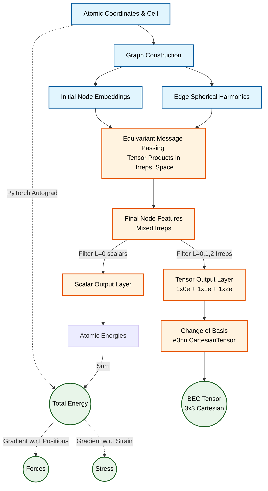

# SevenNet-Polar

SevenNet-Polar is based on the original [SevenNet](https://github.com/sevennet-dev/sevennet) package, a graph neural network (GNN)-based interatomic potential package.

This package extends SevenNet by adding support for Born Effective Charge (BEC) fitting. Additionally, it features an [Atomic Simulation Environment (ASE)](https://wiki.fysik.dtu.dk/ase/) calculator and a LAMMPS interface that support multi-GPU execution.

For general information on the base SevenNet package, please refer to the [SevenNet documentation](https://sevennet.readthedocs.io/en/latest/).

## Features
 - Born Effective Charge (BEC) fitting
 - [Atomic Simulation Environment (ASE)](https://wiki.fysik.dtu.dk/ase/) calculator (python) with multi-GPU support
 - GPU-parallelized molecular dynamics with LAMMPS, featuring multi-GPU support
 - Pretrained GNN interatomic potential and fine-tuning interface
 - CUDA-accelerated D3 (van der Waals) dispersion
 - Multi-fidelity training for combining multiple databases with different calculation settings
 - [Tensor product accelerators](https://sevennet.readthedocs.io/en/latest/user_guide/accelerator.html)

## Architecture Pipeline

Below is a high-level overview of how SevenNet calculates physical properties (Energy, Forces, Stress, and Born Effective Charges) from atomic coordinates:



## Installation and user guides

Installation (including LAMMPS and D3) and user guides for the base package can be found in the [SevenNet documentation](https://sevennet.readthedocs.io/en/latest/).

The old README (prior to v0.12.0) can be found [here](./docs/old_readme/).

## Citation

If you use SevenNet-Polar, please cite our upcoming paper:
```bib
@article{lu_sevennet_polar_202X,
	title = {SevenNet-Polar for MultiTask Prediction of Energy, Forces, Stress, and Born Effective Charges: Development and Application to ZrO2, Li3PO4, and Perovskites},
	journal = {arXiv preprint},
	author = {Lu, Anh Khoa Augustin and Arai, Shungo and Park, Yutack and Han, Seungwu and Miyazaki, Tsuyoshi and Watanabe, Satoshi},
	year = {202X},
}
```

If you use the base SevenNet code, please cite:
```bib
@article{park_scalable_2024,
	title = {Scalable Parallel Algorithm for Graph Neural Network Interatomic Potentials in Molecular Dynamics Simulations},
	volume = {20},
	doi = {10.1021/acs.jctc.4c00190},
	number = {11},
	journal = {J. Chem. Theory Comput.},
	author = {Park, Yutack and Kim, Jaesun and Hwang, Seungwoo and Han, Seungwu},
	year = {2024},
	pages = {4857--4868},
}
```
